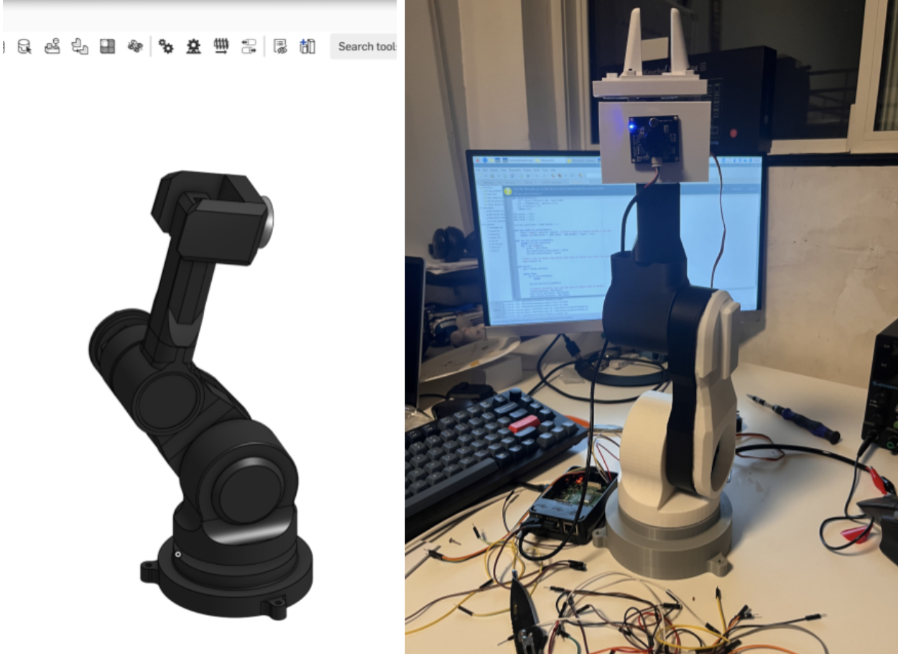

# 3D Printed Desk Robotic Arm

## Overview
The Desk Robotic Arm is a fully functional, 3D-printed robotic arm designed to sit on your desk and perform a variety of tasks. This project combines precision engineering with accessible electronics and software, making advanced robotics available for home use.

  
  
<i>Left: CAD Model designed in Onshape | Right: Final 3D printed implementation with electronics</i>

  
<i>The image above shows the actual printed robot on my desk during development, with the Raspberry Pi visible and connected to various electronics components. The monitor displays the Python code being developed for controlling the arm.</i>

## Project Journey
This project was developed over a three-month period, involving:

* Complete design in Onshape with multiple design iterations
* Extensive 3D printing and refinement phases
* Months of software development for autonomous operation

## Hardware Components
* Tower Pro MG996R servo motors for all joints
* Raspberry Pi as the main controller
* PCA9685 PWM controller board for servo control
* Custom 3D printed parts using PLA/PETG
